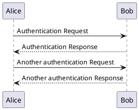

### Numero Primo
```java
class Main{
  BufferedReader r = new BufferedReader (new InputStreamReader (System.in));
        String s;
        System.out.println("Ingrese un número: \n");
        while (  (s=r.readLine()) != null) {
            System.out.println(is_my_number_prime(s));
        }
}
```
***Method***
```java
 public static String is_my_number_prime(String input)
    {
        //Su código va acá
        int vareval;
        if(input.isEmpty() || input == null ){
            return "debe ingresar un valor";
        }
        try {
            vareval = Integer.parseInt(input);
        }catch (NumberFormatException exn){
            exn.getMessage();
            return "solo debe ingresar numeros no letras";
        }catch (Exception ex){
            ex.getMessage();
            return "error de input";
        }
        boolean prime = true;

        try {
            for (int i = 2; i < vareval; i++) {
                if (vareval % i == 0) {
                    prime = false;
                    break;
                }
            }
        }catch (ArithmeticException ae){
            ae.getMessage();
            return "error en input";
        }
        catch (Exception ex){
            ex.getMessage();
            return "error en input";
        }

        if (prime) {
            input = "PRIMO";
        } else {
            input = "NO_ES_PRIMO";
        }
        return input;

    }
```

